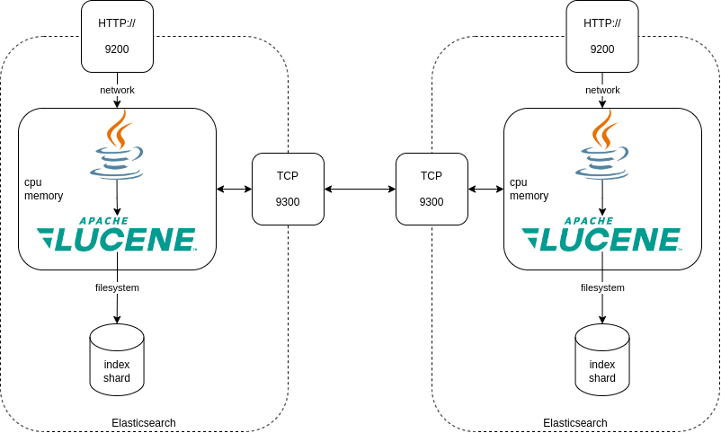
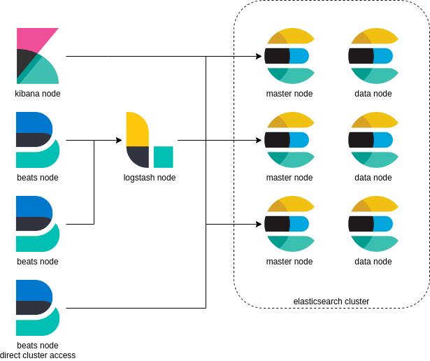

# elasticsearch pour les ops
## Jour 1
---
## Objectifs de la journée

* Savoir ce qu'est _Elasticsearch_
* Connaitre ses cas d'usage
* Connaitre le vocabulaire associé
* Comprendre les architectures Elasticsearch
* Savoir _indexer_ et _requêter_ des documents

---

## Plan
* Introduction à Elasticsearch
* Installation & configuration
* Indexer des documents, search
* Aggregation, Field Mappings

---
## Elasticsearch, c'est quoi
* Moteur de recherche
* Distribué
* API Rest
* Un écosystème

---
## Apache Lucene

Lucene est une bibliothèque Java.

Permet d'indexer et de rechercher des données.

Lucene fonctionne en local sur un seul nœud.

---
## Elasticsearch et Lucene

Elasticsearch s'appuie sur Lucene.

Mise à disposition sous forme de cluster.

Interface API / REST.

---

## Elasticsearch et Lucene

 <!-- .element: class="r-stretch" -->

---

## Définitions & Vocabulaire

> Document :
>
> Unité de stockage dans Elasticsearch (un document _JSON_)

===

> Field/Champ :
>
> Une donnée _nommée_ et _typée_ dans un document (un attribut de document _JSON_).
> Les champs peuvent être de plusieurs types, _texte_, _nombre_, _date_,... 

===

> Index :
> 
> Unité logique de stockage. Contient des _documents_. Une structure optimisée pour la recherche de données.
> L'indexation d'un _document_ se fait dans un _index_.
> La recherche se fait dans un _index_.
> Les données d'un index sont similaires (les documents ont une structure similaire).

===

> Mapping :
>
> La définition des _champs_ d'un _index_, nom et types. Utilisé pour définir comment les champs doivent être indexés et recherchés.

===

> Shard :
> 
> Partition d'un index. Unité physique de stockage.
> Un shard est stocké sur un _nœud_. Un document est présent dans un seul _shard_.
> Les _shard_s peuvent être répliqués pour assurer de la haute disponibilité. 

===

> Shards primaires et replicas:
>
> Un document est présent dans un shard _primaire_.
> Un shard _replica_ est une copie d'un shard _primaire_. 
> Les _shard_s _replica_ sont utilisés pour la redondance de données (perte de nœuds).
> Les _shard_s _replica_ sont utilisés en lecture pour répondre à des requêtes.

===

> Noeud :
> 
> Une machine d'une cluster Elasticsearch.
> Héberge des _shards_.

===

> Cluster :
> 
> Ensemble de nœuds travaillant ensemble pour stocker et traiter des _index_. 

---
## Cas d'usage d'Elasticsearch

* Recherche "full-text" : recherche dans les applications web, portails, etc...
* Analyse de logs : agrégation de logs de sources multiples (serveurs/pods...), consultation et analyse
* Analyse de métriques : agrégation de métriques de sources multiples, consultation et analyse
* Recherche géospatiale : marketing geolocalisé, suivi de flotte, etc...
* Recherche de medias

---

## La stack Elastic (_Elastic Stack_)

* _Elasticsearch_ : moteur d'indexation et de recherche
* _Kibana_ : Interface graphique de requêtage, exploration et configuration
* _Logstash_ : Ingestion de données, transformation
* _Beats_ : Agents de collecte de logs et métriques

_ELK_ = Ancien nom de l'_Elastic Stack_ : *E*lasticsearch + *L*ogstash + *K*ibana

---

## La stack Elastic (_Elastic Stack_)

 <!-- .element: class="r-stretch" -->


---

## Une architecture _Elastic Stack_

 <!-- .element: class="r-stretch" -->

---

## L'indexation

Indexation dynamique :

* pas de déclaration préalable de la structure de l'_index_ (_mapping_)
* chaque nouveau champ détecté sera géré en indexation
* attention aux types de données envoyées dans le JSON :
  * `"true" != true`
  * `"false" != false`
  * `"1" != 1`

L'indexation _basique_ permet de démarrer rapidement, mais n'est pas optimisée.

---

## L'indexation

Les propriétés d'un index:

* `index.number_of_shards` : nombre de shards primaires. Positionné à la création. Ne peut pas être modifié. Valeur à `1` par défaut.
* `index.number_of_replicas`: nom de shards _replica_ pour chaque shard _primaire_. Peut être modifié. Valuer à `1` par défaut. Ne jamais positionner à `0` => risque de perte de données.

---

## Scalabilité et résilience

Elasticsearch est scalable _horizontalement_.

On peut ajouter des _nœuds_ à un _cluster_ pour augmenter la taille de stockage disponible et répartir les traitements.

Le modèle de _sharding_ (_primaire_, _replica_) permet d'être résistant à la panne.

Elasticcsearch se charge de distribuer les données et les requêtes.

---

## Allocation des shards d'un index.

Dans un cluster hétérogène, on veut pouvoir contrôler l'allocation des shards.


---

## Indexation de documents

```http request
POST <index_name>/_doc/<id>
{
  // document
}
```

Le nom de l'index est *obligatoire*.

L'identifiant est *facultatif*.

---


## Exemples choisis :

```
POST starwars_characters/_doc/1
{
  "name": "Darth Vader",
  "species": "Human",
  "affiliation": "Galactic Empire"
}
--
{
  "_index": "starwars_characters",
  "_id": "1",
  "_version": 2,
  "result": "updated",
  "_shards": {
    "total": 2,
    "successful": 2,
    "failed": 0
  },
  "_seq_no": 2,
  "_primary_term": 1
}
```

===

```http request
POST starwars_characters/_doc/2
{
  "name": "Luke Skywalker",
  "species": "Human",
  "affiliation": "Rebel Alliance"
}
--
{
  "_index": "starwars_characters",
  "_id": "2",
  "_version": 1,
  "result": "created",
  "_shards": {
    "total": 2,
    "successful": 2,
    "failed": 0
  },
  "_seq_no": 1,
  "_primary_term": 1
}
```

===

```http request
POST dragonball_characters/_doc
{
  "name": "Goku",
  "race": "Saiyan",
  "power_level": 9001,
  "favorite_technique": "Kamehameha"
}
--
{
  "_index": "dragonball_characters",
  "_id": "rRbN5IYB1dofWQObFlRD",
  "_version": 1,
  "result": "created",
  "_shards": {
    "total": 2,
    "successful": 2,
    "failed": 0
  },
  "_seq_no": 0,
  "_primary_term": 1
}
```

===

```http request
POST dragonball_characters/_doc
{
  "name": "Vegeta",
  "race": "Saiyan",
  "power_level": 18000,
  "favorite_technique": "Galick Gun"
}
--
{
  "_index": "dragonball_characters",
  "_id": "rhbN5IYB1dofWQObSlTJ",
  "_version": 1,
  "result": "created",
  "_shards": {
    "total": 2,
    "successful": 2,
    "failed": 0
  },
  "_seq_no": 1,
  "_primary_term": 1
}
```

---

## Recherche de documents dans des index

```http request
GET starwars_characters/_search

--
{
  "took": 1,
  "timed_out": false,
  "_shards": {
    "total": 1,
    "successful": 1,
    "skipped": 0,
    "failed": 0
  },
  "hits": {
    "total": {
      "value": 2,
      "relation": "eq"
    },
    "max_score": 1.0,
    "hits": [
      {
        "_index": "starwars_characters",
        "_id": "2",
        "_score": 1.0,
        "_source": {
          "name": "Luke Skywalker",
          "species": "Human",
          "affiliation": "Rebel Alliance"
        }
      },
      {
        "_index": "starwars_characters",
        "_id": "1",
        "_score": 1.0,
        "_source": {
          "name": "Darth Vader",
          "species": "Human",
          "affiliation": "Galactic Empire"
        }
      }
    ]
  }
}
```

=== 

```http request
GET starwars_characters/_search?q=Vader

--
{
  "took": 1,
  "timed_out": false,
  "_shards": {
    "total": 1,
    "successful": 1,
    "skipped": 0,
    "failed": 0
  },
  "hits": {
    "total": {
      "value": 1,
      "relation": "eq"
    },
    "max_score": 0.6931471,
    "hits": [
      {
        "_index": "starwars_characters",
        "_id": "1",
        "_score": 0.6931471,
        "_source": {
          "name": "Darth Vader",
          "species": "Human",
          "affiliation": "Galactic Empire"
        }
      }
    ]
  }
}
```

---

## Getting index informations

Aliases, Mappings, Settings

```http request
GET starwars_characters
--
{
  "starwars_characters": {
    "aliases": {},
    "mappings": {
      "properties": {
        "affiliation": {
          "type": "text",
          "fields": {
            "keyword": {
              "type": "keyword",
              "ignore_above": 256
            }
          }
        },
        "name": {
          "type": "text",
          "fields": {
            "keyword": {
              "type": "keyword",
              "ignore_above": 256
            }
          }
        },
        "species": {
          "type": "text",
          "fields": {
            "keyword": {
              "type": "keyword",
              "ignore_above": 256
            }
          }
        }
      }
    },
    "settings": {
      "index": {
        "routing": {
          "allocation": {
            "include": {
              "_tier_preference": "data_content"
            }
          }
        },
        "number_of_shards": "1",
        "provided_name": "starwars_characters",
        "creation_date": "1678875502566",
        "number_of_replicas": "1",
        "uuid": "P904M3SVSk-ZlKbU2QuKmA",
        "version": {
          "created": "8060299"
        }
      }
    }
  }
}
```

---

## Les alias

Permettent de nommer des indexes, ou les regrouper sous un nom différent.

Les alias ne sont pas dynamiques (doivent être re-créés pour prendre en compte un nouvel index)
