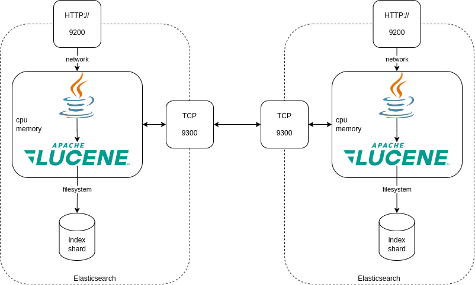
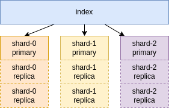
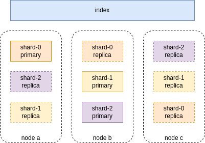

# elasticsearch pour les ops

## Jour 1

---

## Comment lire ces slides ?

Faites attention à la navigation dans les slides quand vous les relisez !

Les flèches en bas à droite vous indiquent la navigation dans les slides :


===

La touche `ECHAP` vous permet d'avoir une vue d'ensemble.

Les flèches directionnelles permettent de naviguer.

La touche `ESPACE` permet d'aller au slide suivant.

---

## Objectifs de la journée

* Savoir ce qu'est _Elasticsearch_
* Connaitre ses cas d'usage
* Connaitre le vocabulaire associé
* Comprendre les architectures Elasticsearch
* Savoir _indexer_ et _requêter_ des documents

---
## Elasticsearch, c'est quoi ?
* Moteur de recherche
* Distribué
* API Rest
* Un écosystème

===

### Apache Lucene

Lucene est une bibliothèque Java.

Permet d'indexer et de rechercher des données.

Lucene fonctionne en local sur un seul nœud.

===

### Elasticsearch et Lucene

Elasticsearch s'appuie sur Lucene.

Mise à disposition sous forme de cluster.

Interface API / REST.

===

### Elasticsearch et Lucene

 <!-- .element: class="r-stretch" -->

---

### Cas d'usage d'Elasticsearch

* Recherche "full-text" : recherche dans les applications web, portails, etc...
* Analyse de logs : agrégation de logs de sources multiples (serveurs/pods...), consultation et analyse
* Analyse de métriques : agrégation de métriques de sources multiples, consultation et analyse
* Recherche géospatiale : marketing géolocalisé, suivi de flotte, etc...

---

## Scalabilité et résilience

Elasticsearch est scalable _horizontalement_.

On peut ajouter des _nœuds_ à un _cluster_ pour augmenter la taille de stockage disponible et répartir les traitements.

Le modèle de _sharding_ (_primaire_, _replica_) permet d'être résistant à la panne.

Elasticsearch se charge de distribuer les données et les requêtes.

---

## Elasticsearch VS les BDD

Les bases de données relationnelles sont dites _ACID_ :

* Atomicité des transactions (tout ou rien)
* Consistance des données (pas d'état incorrect)
* Isolation (plusieurs transactions en //)
* Durabilité des données, en cas de crash après un commit

Elasticsearch ne couvre aucune de ces propriétés.

Elasticsearch ne *doit* pas être utilisé comme une base de données.

---

## La stack Elastic (_Elastic Stack_)

* _Elasticsearch_ : moteur d'indexation et de recherche
* _Kibana_ : Interface graphique de requêtage, exploration et configuration
* _Logstash_ : Ingestion de données, transformation
* _Beats_ : Agents de collecte de logs et métriques

_ELK_ = Ancien nom de l'_Elastic Stack_ : *E*lasticsearch + *L*ogstash + *K*ibana

===

 <!-- .element: class="r-stretch" -->

===

 <!-- .element: class="r-stretch" -->


===

## La gouvernance d'Elasticsearch

Elasticsearch est développé par la société _Elasticsearch_.

Le code est disponible, en Open Source sur [Github](https://github.com/elastic/elasticsearch).

Licence en SSPL (Server Side Public Licence). Cette licence autorise l'utilisation gratuite du produit, mais exige le reversement de toutes les sources si on vend le produit en SaaS.

---

## Définitions & Vocabulaire

> Document :
>
> Unité de stockage dans Elasticsearch (un document _JSON_)

===

> Field/Champ :
>
> Une donnée _nommée_ et _typée_ dans un document (un attribut de document _JSON_).
> Les champs peuvent être de plusieurs types, _texte_, _nombre_, _date_,... 

===

> Index :
> 
> Unité logique de stockage. Contient des _documents_. Une structure optimisée pour la recherche de données.
> L'indexation d'un _document_ se fait dans un _index_.
> La recherche se fait dans un _index_.
> Les données d'un index sont similaires (les documents ont une structure similaire).

===

> Alias : 
> 
> Un nom secondaire pour un _index_ ou un groupe d'_index_.
> Permet de manipuler des noms constants. 
> 
> Exemples : 
> 
> `products` -> `products.2023.03`
> `logs-apache` -> `logs-apache-*`

===

> Query :
> 
> Une requête sur un _index_, un groupe d'_index_ (ex : `products-*`) ou un alias.
> 
> Une requête s'écrit en JSON.

===

> Mapping :
>
> La définition des _champs_ d'un _index_, nom et types. Utilisé pour définir comment les champs doivent être indexés et recherchés.

===

> Noeud :
>
> Une machine d'une cluster Elasticsearch.

===

> Cluster :
>
> Ensemble de nœuds travaillant ensemble pour stocker et traiter des _index_.

===

> Shard :
> 
> Partition d'un index. Unité physique de stockage.
> Un shard est stocké sur un _nœud_. Un document est présent dans un seul _shard_.
> Les _shard_ peuvent être répliqués pour assurer de la haute disponibilité. 

===

> Shards primaires et replicas:
>
> Un document est présent dans un shard _primaire_.
> Un shard _replica_ est une copie d'un shard _primaire_. 
> 
> Les shards _replica_ sont utilisés pour la redondance de données (perte de nœuds).
> Les shards _replica_ sont utilisés en lecture pour répondre à des requêtes.

===

> Shards primaires et replicas



===

> Shards primaires et replicas & nodes



===

> Sécurité, Users & RBAC
> 
> Les lectures/écritures sur Elasticsearch doivent être sécurisées.

Chaque requête doit être authentifiée :
* `Authorization: Basic <TOKEN>` pour un utilisateur
* `Authorization: Bearer <TOKEN>` pour un service account 
* `Authorization: ApiKey <APIKEY>` pour une clé d'API

===

> Refresh
> 
> Quand un document est stocké dans Elasticsearch, il est disponible au plus tard moins d'une seconde après pour les recherches.
> 
> Ce comportement est lié au fonctionnement interne de buffering de Lucene et peut être paramétré.

---

## Indexation de documents

### Création d'un index ([doc](https://www.elastic.co/guide/en/elasticsearch/reference/current/indices-create-index.html#indices-create-index))

```http request
PUT <index_name>
```
```json
{
// propriétés de l'index
}
```

Le nom de l'index est *obligatoire*.

Nous verrons les propriétés plus loin.

===

#### Contraintes sur le nom des index ([doc](https://www.elastic.co/guide/en/elasticsearch/reference/current/indices-create-index.html#indices-create-api-path-params))

* minuscules
* pas de caractères spéciaux hormis `-` et `_`

Prévoir une norme de nommage des index pour s'y retrouver.


===

### Indexation d'un document ([doc](https://www.elastic.co/guide/en/elasticsearch/reference/current/docs-index_.html))

```http request
POST <index_name>/_doc/<id>
```
```json
{
  // document JSON
}
```

Le nom de l'index est *obligatoire*.

L'identifiant est *facultatif*.

Si l'index n'existe pas, il est créé.

===

### Exemples choisis

```http request
POST starwars_characters/_doc/1
```
```json
{
   "name": "Luke Skywalker",
   "species": "Human",
   "gender": "Male",
   "homeworld": "Tatooine",
   "occupation": "Jedi Knight",
   "affiliation": ["Rebel Alliance", "New Jedi Order"],
   "favorite_quote": "I am a Jedi, like my father before me."
}
```

===

```json
{
  "_index": "starwars_characters",
  "_id": "1",
  "_version": 1,
  "result": "created",
  "_shards": {
    "total": 2,
    "successful": 1,
    "failed": 0
  },
  "_seq_no": 0,
  "_primary_term": 1
}
```

===

```http request
POST starwars_characters/_doc/2
```
```json
{
   "name": "Darth Vader",
   "species": "Human",
   "gender": "Male",
   "homeworld": "Tatooine",
   "occupation": "Sith Lord",
   "affiliation": ["Galactic Empire", "Sith Order"],
   "favorite_quote": "I find your lack of faith disturbing."
}
```

===

```json
{
  "_index": "starwars_characters",
  "_id": "2",
  "_version": 1,
  "result": "created",
  "_shards": {
    "total": 2,
    "successful": 1,
    "failed": 0
  },
  "_seq_no": 1,
  "_primary_term": 1
}
```

---

## TP Indexation


===

### Pré-requis

Vous allez avoir besoin :

* d'un client HTTP (Postman, Insomnia, curl)
* d'un accès internet !

L'url du cluster pour jouer :
* https://fictional-characters.es.europe-west1.gcp.cloud.es.io
* ApiKey : 
```
ZnhSSkxZY0J2RkQ3VU0yRFE5SG86UjNmMmlCYWJURkMyaTNvc1NOWUZFQQ==
```

===

### Comment construire vos requêtes :

```bash
curl --request GET \
  --url https://fictional-characters.es.europe-west1.gcp.cloud.es.io/dragonball_characters/_search \
  --header 'Authorization: ApiKey ZnhSSkxZY0J2RkQ3VU0yRFE5SG86UjNmMmlCYWJURkMyaTNvc1NOWUZFQQ=='
```

```bash
curl --request POST \
  --url https://fictional-characters.es.europe-west1.gcp.cloud.es.io/dragonball_characters/_doc \
  --header 'Authorization: ApiKey ZnhSSkxZY0J2RkQ3VU0yRFE5SG86UjNmMmlCYWJURkMyaTNvc1NOWUZFQQ==' \
  --header 'Content-Type: application/json' \
  --data '{}'
```

===

### Sujet

* Créez un index _dragon ball_ portant votre nom
* Indexez quelques documents.

[Goku](documents/db_goku.json) | [Vegeta](documents/db_vegeta.json) | [Bulma](documents/db_bulma.json) | [Piccolo](documents/db_piccolo.json) | [Future Trunks](documents/db_future_trunks.json) | [Master Roshi](documents/db_master_roshi.json)

* Créez un index _star wars_ portant votre nom
* Indexez quelques documents.

[Darth Vader](documents/sw_darth_vader.json) | [Luke Skywalker](documents/sw_luke_skywalker.json) | [Leia Organa](documents/sw_leia_organa.json) | [Han Solo](documents/sw_han_solo.json) | [Obi-Wan Kenobi](documents/sw_obi_wan_kenobi.json) | [Yoda](documents/sw_yoda.json)

===

### Correction


---

## Requêter des documents - Query

Une requête est parsée, envoyée aux index concernés, exécutée par les _shards_. Les résultats sont scorés, puis agrégés avant d'être renvoyés.

Une requête est traitée dans un _shard_ par un seul thread, néanmoins, chaque _shard_ peut exécuter plusieurs threads en parallèle.

===

### Compter les documents ([doc](https://www.elastic.co/guide/en/elasticsearch/reference/current/search-count.html))

```http request
GET starwars_characters/_count
```

```json
{
  "count": 2,
  "_shards": {
    "total": 1,
    "successful": 1,
    "skipped": 0,
    "failed": 0
  }
}
```

Il est aussi possible de passer une query en paramètre, pour compter les documents qui matchent certains critères.

===

### Recherche de tous les documents ([doc](https://www.elastic.co/guide/en/elasticsearch/reference/current/search-search.html))

```http request
GET starwars_characters/_search
```
```json
{
  "took": 0,
  "timed_out": false,
  "_shards": {
    "total": 1,
    "successful": 1,
    "skipped": 0,
    "failed": 0
  },
  "hits": {
    "total": {
      "value": 2,
      "relation": "eq"
    },
    "max_score": 1.0,
    "hits": [
      {
        "_index": "starwars_characters",
        "_id": "1",
        "_score": 1.0,
        "_source": {
          "name": "Darth Vader",
          "species": "Human",
          "affiliation": "Galactic Empire",
          "quote": "Tu sous-estimes le pouvoir du côté obscur. Si tu refuses de te battre, tu devras affronter ton destin."
        }
      },
      {
        "_index": "starwars_characters",
        "_id": "2",
        "_score": 1.0,
        "_source": {
          "name": "Luke Skywalker",
          "species": "Human",
          "affiliation": "Rebel Alliance",
          "quote": "Vous auriez dû négocier, Jabba. C’est la dernière erreur que vous commettez."
        }
      }
    ]
  }
}
```

===

#### Recherche et pagination

10 documents remontés par défaut. 

Paramètres `from` et `size` pour faire de la pagination.

```json
{
  "from": 2, // numéro de la page
  "size": 20 // taille de la page
}
```

===

### Le résultat d'une recherche ([doc](https://www.elastic.co/guide/en/elasticsearch/reference/current/search-search.html#search-api-response-body))

* `took` : durée de traitement de la requête en _ms_
* `_shards` : infos sur les _shards_ parcourus par la requête
* `hits` : résultats + méta-données
* `hits.hits` : résultat : 
  * `_index` contenant le document
  * `_id` du document
  * `_score` de la recherche sur ce document
  * `_source` du document

===

### Recherche avec un body JSON

```http request
GET <target>/_search
```
```json
{
  "query": {
    <query_elements>
  }
}
```

`target` est l'index, l'alias ou un wildcard (`log-*`) dans lequel rechercher

===

### Les types de _query_

#### Match all ([doc](https://www.elastic.co/guide/en/elasticsearch/reference/current/query-dsl-match-all-query.html))

Tous les documents !

```http request
GET starwars_characters/_search
```
```json
{
  "query": {
    "match_all": {}
  }
}
```

===

#### Match ([doc](https://www.elastic.co/guide/en/elasticsearch/reference/current/query-dsl-match-query.html))

Recherche *full-texte* sur un champ :

```http request
GET starwars_characters/_search
```
```json
{
  "query": {
    "match": {
      "quote": "côté obscur"
    }
  }
}
```

===

#### Term ([doc](https://www.elastic.co/guide/en/elasticsearch/reference/current/query-dsl-term-query.html))

Recherche *exacte* sur un champ :

```http request
GET starwars_characters/_search
```
```json
{
  "query": {
    "term": {
      "name": "Darth Vader"
    }
  }
}
```

Convient aux ID, username, énumérations...

===

#### Range ([doc](https://www.elastic.co/guide/en/elasticsearch/reference/current/query-dsl-range-query.html))

Recherche sur la valeur d'un champ dans une fourchette de valeurs :

```http request
GET dragonball_characters/_search
```
```json
{
  "query": {
    "range": {
      "power_level": {
        "gt": 9000,
        "lt": 1000
      }
    }
  }
}
```

Paramètres: `gt`, `gte`, `lt`, `lte` (greater/lower than or equal).

===

#### Query combinées ([doc](https://www.elastic.co/guide/en/elasticsearch/reference/current/query-dsl-bool-query.html))

Les recherches peuvent être de plusieurs types et sur plusieurs champs.

Utiliser une recherche `bool`, avec un tableau de `must`, `should`, ou `must_not`.

===

```http request
GET dragonball_characters/_search
```
```json
{
  "query": {
    "bool": {
      "must": [
        {
          "term": {
            "friends": "bulma"
          }
        },
        {
          "range": {
            "power_level": {
              "lt": 10000
            }
          }
        }
      ]
    }
  }
}
```

===

### Trier les documents

Le paramètre `sort` permet de déclarer un tri

```http request
GET dragonball_characters/_search
```
```json
{
  "query": {
    "range": {
      "power_level": {
        "gt": 9000
      }
    }
  },
  "sort": {
    "name": "asc"
  }
}
```

===

### Projections

Le paramètre `fields` permet de préciser quels champs remonter dans le résultat.
Souvent utilisé avec `_source: false` pour ne pas remonter le document complet.

```http request
GET dragonball_characters/_search
```
```json
{
  "query": {
    "range": {
      "power_level": {
        "gt": 9000
      }
    }
  },
  "fields": ["name", "power_level"],
  "_source": false
}
```

---

## TP Recherche


===

### Sujet

Le cluster contient plusieurs index :

* pokemons_gen1
* pokemons_gen2

===

### Combien de documents contient chaque index ?

===

### Recherches à exécuter (gen1)

* Quels sont les `types` du Pokémon de gen1 ayant pour `name` `nidoqueen` ?
* Quel est le poids (`weight`) du Pokémon de gen1 ayant pour `id` `25` ?
* Combien de Pokémon de gen1 ont une `stats.attack` supérieure ou égale à `125` ?
* Combien de Pokémon de gen1 ont une `stats.hp` égale à `100` ?
* Combien de Pokémon de gen1 ont le `type` `dragon` ?

===

### Recherches à exécuter (gen2)

* Quels sont les Pokémon de gen2 ayant `vitesse` dans leur `description` ?
* Quel est le nom (`name`) du Pokémon de gen2 ayant pour `id` `175` ?
* Combien de Pokémon de gen2 ont une `stats.attack` comprise entre `120` et `130` ?
* Combien de Pokémon de gen2 ont le `type` `dragon` ?
* Combien de Pokémon de gen2 ont une `stats.attack` entre `120` et `130` inclus _et_ une `stats.defense` supérieure à `100` ?

===

### Correction des requêtes


---

## C'est fini pour aujourd'hui !


