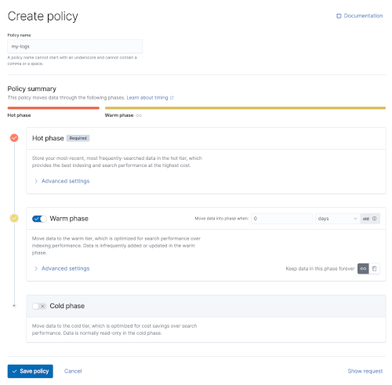
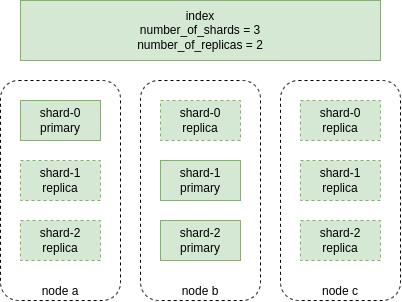
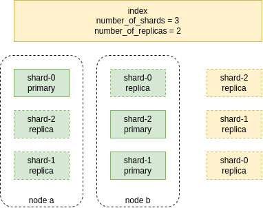
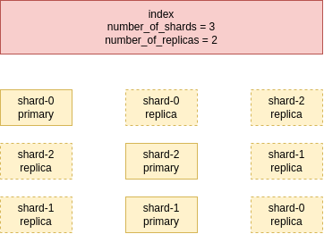
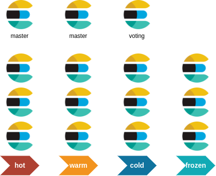

# elasticsearch pour les ops

## Jour 3

---

## Objectifs de la journée

* Index Lifecycle Management
* Sauvegarde et Restauration
* Les API CAT
* Les rôles d'un node
* Bonnes pratiques d'installation
* Savoir dimensionner un cluster
* Savoir monitorer un cluster
* Savoir faire une maintenance des nodes


---

## Index Lifecycle Management (ILM) ([doc](https://www.elastic.co/guide/en/elasticsearch/reference/current/index-lifecycle-management.html))

Gestion de la vie des index :

* rotation automatique (taille / nb de documents / daily )
* déplacement de classe de stockage (hot / warm / cold / frozen)
* suppression de données

===

### Phases ([doc](https://www.elastic.co/guide/en/elasticsearch/reference/current/ilm-index-lifecycle.html))

ILM définit des _phases_ :


Une _policy_ définit les _phases_ à utiliser, quelles actions faire dans chaque _phase_, et les transitions entre les phases.

Les transitions entre les phases sont temporelles (en jours).

===

### Actions ([doc](https://www.elastic.co/guide/en/elasticsearch/reference/current/ilm-actions.html))

Dans chaque _phase_, ILM peut :

* faire des rotations sur un critère : `max_age`, `max_docs`, `max_size`
* passer des index en `read-only`
* changer le nombre de replicas
* migrer les données dans une `data tier`
* faire un `shrink` sur les index
* Supprimer les index


===

### Actions & Phases

Toutes les phases ne supportent pas toutes les actions :

* une action `read-only` en phase `hot` n'a pas de sens
* une action `delete` ne se fait qu'en phase `delete`

===

### Création d'une policy dans Kibana



===

### Création d'une policy en REST ([doc](https://www.elastic.co/guide/en/elasticsearch/reference/current/ilm-put-lifecycle.html))

```http request
PUT _ilm/policy/<my_policy>
```
```json
{
  "policy": {
    "phases": {
      "hot": {
        "actions": {
          "rollover" : {
            "max_size": "100gb"
          }
        }
      },
      "warm": {
        "min_age": "10d",
        "actions": {
          "allocate": {
            "number_of_replicas": 1
          },
          "readonly": {}
        }
      },
      "delete": {
        "min_age": "30d",
        "actions": {
          "delete": {}
        }
      }
    }
  }
}
```

===

### Assignation d'une policy à un index ([doc](https://www.elastic.co/guide/en/elasticsearch/reference/master/set-up-lifecycle-policy.html#apply-policy-manually))

Utiliser le _settings_ `index.lifecycle.name` pour préciser la policy d'un index :

```http request
PUT dragonball_characters/_settings
```
```json
{
  "settings": {
    "index.lifecycle.name": "<policy name>",
    "index.lifecycle.rollover_alias": "<rollover alias name>>"
  }
}
```

Peut aussi être précisé dans un _index template_.

===

### Surveiller l'exécution d'une policy ([doc](https://www.elastic.co/guide/en/elasticsearch/reference/current/ilm-explain-lifecycle.html))

```http request
GET dragonball_characters/_ilm/explain
```
```json
{
  "indices": {
    "dragonball_characters": {
      "index": "dragonball_characters",
      "index_creation_date_millis": 1538475653281,
      "time_since_index_creation": "15s",
      "managed": true,
      "policy": "my_policy",
      "lifecycle_date_millis": 1538475653281,
      "age": "15s",
      "phase": "new",
      "phase_time_millis": 1538475653317,
      "action": "complete"
      "action_time_millis": 1538475653317,
      "step": "complete",
      "step_time_millis": 1538475653317,
      "step_info": {
        "message": "Waiting for all shard copies to be active",
        "shards_left_to_allocate": -1,
        "all_shards_active": false,
        "number_of_replicas": 2
      },
      "phase_execution": {
        "policy": "my_lifecycle3",
        "phase_definition": {
          "min_age": "0ms",
          "actions": {
            "rollover": {
              "max_age": "30s"
            }
          }
        },
        "version": 3,
        "modified_date": "2018-10-15T13:21:41.576Z",
        "modified_date_in_millis": 1539609701576
      }
    }
  }
}
```

===

#### Champs à surveiller

A surveiller:

* `failed_step` : étape qui a échouée
* `step_info` : détails sur l'erreur

```json
{
  "failed_step": "check-rollover-ready",
  "is_auto_retryable_error": true,
  "failed_step_retry_count": 1,
  "step_info": {
    "type": "cluster_block_exception",
    "reason": "index [test-000057/H7lF9n36Rzqa-KfKcnGQMg] blocked by: [FORBIDDEN/5/index read-only (api)",
    "index_uuid": "H7lF9n36Rzqa-KfKcnGQMg",
    "index": "test-000057"
  }
}
```

===

### Forcer une exécution de _phase_ ([doc](https://www.elastic.co/guide/en/elasticsearch/reference/current/ilm-move-to-step.html))

Il est possible de forcer l'exécution d'une phase de policy pour un index.

Les `current_step` `phase`, `action` et `name` peuvent être récupérés avec un `GET <index>/_ilm/explain`.

===

```http request
POST _ilm/move/<index>
```
```json
{
  "current_step": {
    "phase": "hot",
    "action": "complete",
    "name": "complete"
  },
  "next_step": {
    "phase": "warm"
  }
}
```

===

### Dans Kibana

Parcours des écrans ILM dans Kibana :

* Dans _Management/Stack Management_
* Menu _Data/Index Lifecycle Policies_

---

## Sauvegarde et Restauration

Pas besoin de sauvegarder le filesystem des _nodes_.

Il vaut mieux utiliser des Snapshots (équivalent d'un dump).

===

### Snapshot repositories

un _repository_ permet de stocker des _snapshot_ ([doc](https://www.elastic.co/guide/en/elasticsearch/reference/current/snapshots-register-repository.html)).

Implémentations disponibles :

* AWS S3
* Google Cloud Storage (GCS)
* Azure Blob Storage
* Shared File System (NFS)

===

### Un snapshot

* Peut contenir un ou plusieurs _index_
* Contiendra les _mapping_, _settings_, et _alias_ des index sauvegardés
* Peut contenir le `state` du cluster (ILM policies, index templates)

===

### Créer un _snapshot_ manuellement ([doc](https://www.elastic.co/guide/en/elasticsearch/reference/current/create-snapshot-api.html))

```http request
PUT /_snapshot/<repository>/<snapshot name>
```
```json
{
  "indices": ["starwars_characters", "dragonball_characters"],
  "metadata": { // optionnel
    "taken_by": "Julien",
    "taken_because": "Test Snapshot"
  }
}
```

===

### Sauvegarder le state du cluster ([doc](https://www.elastic.co/guide/en/elasticsearch/reference/current/create-snapshot-api.html))

```http request
PUT /_snapshot/<repository>/<snapshot name>
```
```json
{
  "include_global_state": true
}
```

===

### Suivre le statut d'un _snapshot_ ([doc](https://www.elastic.co/guide/en/elasticsearch/reference/current/get-snapshot-status-api.html))

```http request
GET _snapshot/<repository>/<snapshot_name>/_status
```
```json
{
  "snapshots": [
    {
      "snapshot": "manual_snapshot",
      "uuid": "G0Ej1bfqRMC8tCxq8PjUJg",
      "repository": "found-snapshots",
      "version_id": 8060299,
      "version": "8.6.2",
      "indices": [
        "dragonball_characters",
        "starwars_characters"
      ],
      "data_streams": [],
      "include_global_state": false,
      "metadata": {
        "taken_by": "Julien",
        "taken_because": "Test Snapshot"
      },
      "state": "SUCCESS",
      "start_time": "2023-03-29T17:50:44.351Z",
      "start_time_in_millis": 1680112244351,
      "end_time": "2023-03-29T17:50:45.952Z",
      "end_time_in_millis": 1680112245952,
      "duration_in_millis": 1601,
      "failures": [],
      "shards": {
        "total": 2,
        "failed": 0,
        "successful": 2
      },
      "feature_states": []
    }
  ],
  "total": 1,
  "remaining": 0
}
```

===

### Lister les _snapshot_ ([doc](https://www.elastic.co/guide/en/elasticsearch/reference/current/get-snapshot-api.html))

```http request
GET /_snapshot/my_repository/*
```

### Voir les détails d'un _snapshot_ ([doc](https://www.elastic.co/guide/en/elasticsearch/reference/current/get-snapshot-api.html))

```http request
GET /_snapshot/my_repository/<snapshot_name>
```

===

### Restaurer un _snapshot_ ([doc](https://www.elastic.co/guide/en/elasticsearch/reference/current/restore-snapshot-api.html))

On peut restaurer partiellement un _snapshot_ (un ou plusieurs _index_)

```http request
POST _snapshot/<repository>/<snapshot_name>/_restore
```
```json
{
  "indices": ["starwars_characters"]
}
```

===

### Restaurer un _snapshot_ en renommant les index

On peut renommer les index à la restauration

```http request
POST _snapshot/<repository>/<snapshot_name>/_restore
```
```json
{
  "rename_pattern": "(.+)_characters",
  "rename_replacement": "$1_index"
}
```

Va renommer `dragonball_characters` en `dragonball_index`.

===

### Supprimer un _snapshot_ ([doc](https://www.elastic.co/guide/en/elasticsearch/reference/current/delete-snapshot-api.html))

```http request
DELETE _snapshot/<repository>/<snapshot_name>
```

===

### Snapshot Lifecycle Management (SLM)

Création automatique de snapshots.

Scheduling via une expression crontab, et cible tout le cluster ou certains index.

===

#### Créer une policy SLM ([doc](https://www.elastic.co/guide/en/elasticsearch/reference/current/slm-api-put-policy.html))

```http request
PUT _slm/policy/<name>
```
```json
{
  "schedule": "0 30 1 * * *", // cron
  "name": "nightly-snapshot", 
  "repository": "my_repository",    
  "config": {
    "indices": "dragonball_characters"
  },
  "retention": {                    
    "expire_after": "30d",
    "min_count": 5,
    "max_count": 50
  }
}
```

===

### Supprimer une policy

```http request
DELETE _slm/policy/<name>
```

Supprimer une policy ne supprime pas les snapshots créés.

---

## TP Sauvegarde et Restauration


===

### Sujet

On réutilise les mêmes index qu'hier :

* pokemons_gen1
* pokemons_gen2

Il existe un _snapshot repository_ `found-snapshots` sur le cluster.

===

#### Créez un snapshot

* Créez un snapshot contenant les deux index `pokemons_gen1` et `pokemons_gen2`
* Restaurez l'index `pokemons_gen2` dans un nouvel index qui porte votre nom (rename)
* Vérifiez que les données sont bien restaurées :
  * mapping
  * settings
  * bon nombre de documents

===

### Correction de la sauvegarde et restauration

On parcours les écrans dans Kibana.


---

## Les API Cluster ([doc](https://www.elastic.co/guide/en/elasticsearch/reference/current/cluster.html))

Permettent de récupérer des données au niveau du cluster.

===

### Cluster Health ([doc](https://www.elastic.co/guide/en/elasticsearch/reference/current/cluster-health.html))

La santé du cluster est disponible à travers une API :

```http request
GET /_cluster/health
```
```json
{
  "cluster_name": "54e949dcc17043dabbd8f20fa3fb67e7",
  "status": "yellow",
  "timed_out": false,
  "number_of_nodes": 1,
  "number_of_data_nodes": 1,
  "active_primary_shards": 16,
  "active_shards": 16,
  "relocating_shards": 0,
  "initializing_shards": 0,
  "unassigned_shards": 2,
  "delayed_unassigned_shards": 0,
  "number_of_pending_tasks": 0,
  "number_of_in_flight_fetch": 0,
  "task_max_waiting_in_queue_millis": 0,
  "active_shards_percent_as_number": 88.88888888888889
}
```

===

#### `green`, `yellow`, `red`

* `green` : tout va bien
* `yellow` : des _shards_ *replica* ne sont pas alloués à une machine, risque de perte de données si la machine portant le _shard_ primaire est perdue
* `red` : des _shard_ *primaire* ne sont pas alloués

===

##### status `green`



===

##### status `yellow`



===

##### status `red`



===

#### Cluster Health Level

Détails au niveau des index ou des shards :

```http request
GET /_cluster/health?level=indices

GET /_cluster/health?level=shards
```
```json
{
  "cluster_name": "54e949dcc17043dabbd8f20fa3fb67e7",
  "indices": {
    "pokemons_gen1": {
      "status": "yellow",
      "number_of_shards": 1,
      "number_of_replicas": 1,
      "active_primary_shards": 1,
      "active_shards": 1,
      "relocating_shards": 0,
      "initializing_shards": 0,
      "unassigned_shards": 1,
      "shards": {
        "0": {
          "status": "yellow",
          "primary_active": true,
          "active_shards": 1,
          "relocating_shards": 0,
          "initializing_shards": 0,
          "unassigned_shards": 1
        }
      }
    },
    "pokemons_gen2": {
      "status": "yellow",
      "number_of_shards": 1,
      "number_of_replicas": 1,
      "active_primary_shards": 1,
      "active_shards": 1,
      "relocating_shards": 0,
      "initializing_shards": 0,
      "unassigned_shards": 1,
      "shards": {
        "0": {
          "status": "yellow",
          "primary_active": true,
          "active_shards": 1,
          "relocating_shards": 0,
          "initializing_shards": 0,
          "unassigned_shards": 1
        }
      }
    }
  }
}
```

===

### Nodes info ([doc](https://www.elastic.co/guide/en/elasticsearch/reference/current/cluster-nodes-info.html))

Permet de récupérer des informations (très) détaillées sur les nodes :

```http request
GET _nodes
```
```json
{
	"_nodes": {
		"total": 2,
		"successful": 2,
		"failed": 0
	},
	"cluster_name": "54e949dcc17043dabbd8f20fa3fb67e7",
	"nodes": {
		"ot6bbHQJRqO49ee9K2rnZQ": {
			"name": "instance-0000000000",
			"transport_address": "10.43.255.116:19368",
			"host": "10.43.255.116",
			"ip": "10.43.255.116",
			"version": "8.6.2",
			"build_flavor": "default",
			"build_type": "docker",
			"build_hash": "2d58d0f136141f03239816a4e360a8d17b6d8f29",
			"total_indexing_buffer": 53687091,
			"roles": [
				"data_content",
				"data_hot",
				"ingest",
				"master",
				"remote_cluster_client",
				"transform"
			],
			"attributes": {
				"xpack.installed": "true",
				"logical_availability_zone": "zone-0",
				"availability_zone": "europe-west1-b",
				"region": "unknown-region",
				"instance_configuration": "gcp.es.datahot.n2.68x16x45",
				"server_name": "instance-0000000000.54e949dcc17043dabbd8f20fa3fb67e7",
				"data": "hot"
			}
		},
		"JSqRxcPRQ5mdKqeyz-bzSw": {
			"name": "instance-0000000001",
			"transport_address": "10.43.255.50:19482",
			"host": "10.43.255.50",
			"ip": "10.43.255.50",
			"version": "8.6.2",
			"build_flavor": "default",
			"build_type": "docker",
			"build_hash": "2d58d0f136141f03239816a4e360a8d17b6d8f29",
			"total_indexing_buffer": 53687091,
			"roles": [
				"data_content",
				"data_hot",
				"ingest",
				"master",
				"remote_cluster_client",
				"transform"
			],
			"attributes": {
				"xpack.installed": "true",
				"logical_availability_zone": "zone-1",
				"availability_zone": "europe-west1-c",
				"region": "unknown-region",
				"instance_configuration": "gcp.es.datahot.n2.68x16x45",
				"server_name": "instance-0000000001.54e949dcc17043dabbd8f20fa3fb67e7",
				"data": "hot"
			}
		}
	}
}
```

===

### Cluster allocation explain ([doc](https://www.elastic.co/guide/en/elasticsearch/reference/current/cluster-allocation-explain.html))

Cette API décrit les raisons de l'allocation d'un shard (ou pas) sur un node.

Indispensable pour débugger.

```http request
GET _cluster/allocation/explain
```
```json
{
  "index": "pokemons_gen1",
  "shard": 0,
  "primary": true
}
```

===

```json
{
  "index": "pokemons_gen1",
  "shard": 0,
  "primary": true,
  "current_state": "started",
  "current_node": {
    "id": "ot6bbHQJRqO49ee9K2rnZQ",
    "name": "instance-0000000000",
    "transport_address": "10.43.255.116:19368",
    "attributes": {
      "logical_availability_zone": "zone-0",
      "xpack.installed": "true",
      "data": "hot",
      "server_name": "instance-0000000000.54e949dcc17043dabbd8f20fa3fb67e7",
      "instance_configuration": "gcp.es.datahot.n2.68x16x45",
      "region": "unknown-region",
      "availability_zone": "europe-west1-b"
    },
    "weight_ranking": 1
  },
  "can_remain_on_current_node": "yes",
  "can_rebalance_cluster": "no",
  "can_rebalance_cluster_decisions": [
    {
      "decider": "rebalance_only_when_active",
      "decision": "NO",
      "explanation": "rebalancing is not allowed until all replicas in the cluster are active"
    },
    {
      "decider": "cluster_rebalance",
      "decision": "NO",
      "explanation": "the cluster has unassigned shards and cluster setting [cluster.routing.allocation.allow_rebalance] is set to [indices_all_active]"
    }
  ],
  "can_rebalance_to_other_node": "no",
  "rebalance_explanation": "Elasticsearch is not allowed to allocate or rebalance this shard to another node. If you expect this shard to be rebalanced to another node, find this node in the node-by-node explanation and address the reasons which prevent Elasticsearch from rebalancing this shard there."
}
```

===

```http request
GET _cluster/allocation/explain
```
```json
{
  "index": "pokemons_gen1",
  "shard": 0,
  "primary": false
}
```

===

```json
{
  "index": "pokemons_gen1",
  "shard": 0,
  "primary": false,
  "current_state": "unassigned",
  "unassigned_info": {
    "reason": "INDEX_CREATED",
    "at": "2023-03-29T12:13:56.797Z",
    "last_allocation_status": "no_attempt"
  },
  "can_allocate": "no",
  "allocate_explanation": "Elasticsearch isn't allowed to allocate this shard to any of the nodes in the cluster. Choose a node to which you expect this shard to be allocated, find this node in the node-by-node explanation, and address the reasons which prevent Elasticsearch from allocating this shard there.",
  "node_allocation_decisions": [
    {
      "node_id": "ot6bbHQJRqO49ee9K2rnZQ",
      "node_name": "instance-0000000000",
      "transport_address": "10.43.255.116:19368",
      "node_attributes": {
        "logical_availability_zone": "zone-0",
        "xpack.installed": "true",
        "data": "hot",
        "server_name": "instance-0000000000.54e949dcc17043dabbd8f20fa3fb67e7",
        "instance_configuration": "gcp.es.datahot.n2.68x16x45",
        "region": "unknown-region",
        "availability_zone": "europe-west1-b"
      },
      "node_decision": "no",
      "weight_ranking": 1,
      "deciders": [
        {
          "decider": "same_shard",
          "decision": "NO",
          "explanation": "a copy of this shard is already allocated to this node [[pokemons_gen1][0], node[ot6bbHQJRqO49ee9K2rnZQ], [P], s[STARTED], a[id=PnrcdpYuQf-We28hBLgJnA], failed_attempts[0]]"
        }
      ]
    }
  ]
}
```

---


## Les API CAT (Compact & Aligned Text) ([doc](https://www.elastic.co/guide/en/elasticsearch/reference/current/cat.html))

Les API `_cat` sont destinées aux humains, pour la récupération d'infos sur les clusters.

Pratique depuis un browser, ou depuis un shell en `curl`.

===

### Paramètres communs

* `v` : mode verbose (entêtes)
* `h` : filtrer les colonnes
* `help` : liste les colonnes dispos
* `format` : `text`, `json`, `yaml`
* `sort` : tri

à positionner dans les URL :

```http request
GET _cat/health?v&h=name,status
```

===

### `_cat/health` ([doc](https://www.elastic.co/guide/en/elasticsearch/reference/current/cat-health.html))

Santé du cluster

```http request
GET _cat/health
```
```text
epoch      timestamp cluster                          status node.total node.data shards pri relo init unassign pending_tasks max_task_wait_time active_shards_percent
1680185251 14:07:31  54e949dcc17043dabbd8f20fa3fb67e7 yellow          1         1     26  26    0    0       12             0                  -                 68.4%
```

===

### `_cat/indices` ([doc](https://www.elastic.co/guide/en/elasticsearch/reference/current/cat-indices.html))

Liste des index avec leurs détails

```http request
GET _cat/indices
```
```text
health status index         uuid                   pri rep docs.count docs.deleted store.size pri.store.size
yellow open   pokemons_gen1 Ox63zh_PRq-abU7xNm6VOQ   1   1        151            0     46.9kb         46.9kb
yellow open   pokemons_gen2 V4V7pF9gTgmdtw95oJHrwA   1   1        100            0     95.3kb         95.3kb
```

===

### `_cat/shards` ([doc](https://www.elastic.co/guide/en/elasticsearch/reference/current/cat-shards.html))

Liste des _shards_ (tous, ou ceux d'un index)

```http request
GET _cat/shards/pokemons_*
```
```text
index         shard prirep state      docs  store ip            node
pokemons_gen1 0     p      STARTED     151 46.9kb 10.43.255.116 instance-0000000000
pokemons_gen1 0     r      UNASSIGNED
pokemons_gen2 0     p      STARTED     100 95.3kb 10.43.255.116 instance-0000000000
pokemons_gen2 0     r      UNASSIGNED
```

===

### `_cat/nodes` ([doc](https://www.elastic.co/guide/en/elasticsearch/reference/current/cat-nodes.html))

Liste des _node_

```http request
GET _cat/nodes
```
```text
ip            heap.percent ram.percent cpu load_1m load_5m load_15m node.role master name
10.43.255.116           53          98   0    2.52    2.85     3.09 himrst    *      instance-0000000000
```

===

### `_cat/nodeattrs` ([doc](https://www.elastic.co/guide/en/elasticsearch/reference/current/cat-nodeattrs.html))

Liste des attributs de nodes (role et custom)

```http request
GET _cat/nodeattrs
```
```text
node                host          ip            attr                      value
instance-0000000000 10.43.255.116 10.43.255.116 logical_availability_zone zone-0
instance-0000000000 10.43.255.116 10.43.255.116 xpack.installed           true
instance-0000000000 10.43.255.116 10.43.255.116 data                      hot
instance-0000000000 10.43.255.116 10.43.255.116 server_name               instance-0000000000.54e949dcc17043dabbd8f20fa3fb67e7
instance-0000000000 10.43.255.116 10.43.255.116 instance_configuration    gcp.es.datahot.n2.68x16x45
instance-0000000000 10.43.255.116 10.43.255.116 region                    unknown-region
instance-0000000000 10.43.255.116 10.43.255.116 availability_zone         europe-west1-b
```

---

## Observer l'allocation des shards

* `_cat/shards` permet de récupérer la liste de tous les _shards_
* `_cluster/allocation/explain` permet de requêter un _shard_ pour comprendre son allocation

Utiliser les settings pour adapter le nombre de replicas ou les contraintes d'allocation

---

## TP API Cluster & CAT


===

### Sujet

On réutilise les mêmes index qu'hier :

* pokemons_gen1
* pokemons_gen2

===

### Observez la santé du cluster et des index

* Quel est le statut du cluster ?
* Quel est le statut de l'index `pokemons_gen1` ?
* Quel est le statut de l'index `pokemons_gen2` ? Pourquoi ?

===

### Déterminer ce qui ne va pas

* Quel est le statut des _shards_ de l'index `pokemons_gen2` ?
* Utilisez _Cluster Allocation Explain_ pour comprendre pourquoi ?
* Quelles pourraient être les actions correctives ?

===

### Correction


---

## Les rôles d'un node ([doc](https://www.elastic.co/guide/en/elasticsearch/reference/current/modules-node.html))

### Un cluster hétérogène

Des machines de type différentes, hardware différent, disques différents.



===

### `node.roles: [ master ]`

Contrôle le cluster, suit les _node_, décide d'allouer des shards à des _node_.

Ces _node_ ne stockent que des données de metadata.

Préco Elasticsearch : des _node_ `master` dédiés à partir de 5 ou 6 _node_

=== 

### `node.roles: [ master, voting_only ]` ([doc](https://www.elastic.co/guide/en/elasticsearch/reference/current/modules-node.html#voting-only-node))

Participe aux votes pour l'élection d'un _node_ master.

Permet de limiter le nombre de _node_ `master` dédié, en permettant à un _node_ `data` de participer aux élections.

===

### `node.roles: [ data ]` ([doc](https://www.elastic.co/guide/en/elasticsearch/reference/current/modules-node.html#data-node))

Stocker des données et traite des requêtes.

Fort besoins en CPU et RAM.

Possible de spécialiser avec une hiérarchisation (tiering).

===

#### `node.roles: [ data_content ]`

Données stables, qui ne doivent pas changer de _tier_.

Données qui doivent être requêtées rapidement, peu d'écritures, forts besoins en CPU pour avoir des perfs. 

Exemple : catalogue produit.

===

#### `node.roles: [ data_hot ]`


Données stockées sur du hardware récent, I/O intensif (SSD)

Le point d'entrée d'écriture sur des données time-series, données récentes et fréquemment requêtées (qq jours).

===

#### `node.roles: [ data_warm ]`


Données requêtées moins fréquemment, données des dernières semaines, sur du hardware un peu moins couteux.

Souvent, on n'indexe plus de nouvelles données dans des index `warm`.

===

#### `node.roles: [ data_cold ]`


Données qui ne sont plus souvent requêtées, on optimise le cout de stockage, les données restent requêtables quand même, mais on accepte que les requêtes soient plus longues.

===

#### `node.roles: [ data_frozen ]`


Données archivées sous la forme de snapshots, les données restent toujours requêtables, mais les requêtes sont très longues.

---

## Bonnes pratiques d'installation

* Elasticsearch doit être le seul service qui tourne sur une machine (VM ou bare-metal)
* Pas besoin de swap (la JVM consommera uniquement de la RAM)
* Utiliser un user *nix `elasticsearch` dédié


===

### Let the JVM be ([doc](https://www.elastic.co/guide/en/elasticsearch/reference/current/advanced-configuration.html#set-jvm-heap-size))

Laisser Elasticsearch allouer la mémoire de la machine pour la JVM.

Paramètres proposés :

* Utiliser la JVM packagée avec Elasticsearch ([doc](https://www.elastic.co/guide/en/elasticsearch/reference/current/setup.html#jvm-version))
* `-Xms` = `-Xmx` : pour tout de suite allouer la RAM nécessaire
  * Positionner la valeur à 50% de la RAM disponible sur la VM ([doc](https://www.elastic.co/guide/en/elasticsearch/reference/current/advanced-configuration.html#set-jvm-heap-size))
* Utiliser le G1GC : `-XX:+UseG1GC`

===

### Paramètres systèmes utiles

===

#### File Descriptors

ElasticSearch utilise beaucoup de file descriptors, nombre recommandé > `65535` ([doc](https://www.elastic.co/guide/en/elasticsearch/reference/current/file-descriptors.html))

Configuration :
```bash
# /etc/security/limits.conf
elasticsearch - nofile 65535
# ou
root - nofile 65535
```

===

#### Taille maximale d'un fichier

Elasticsearch va créer de gros fichiers pour chaque shared (plusieurs giga octets).

La taille max des fichiers ne doit pas être limitée.

Configuration :

```bash
# /etc/security/limits.conf
elasticsearch - fsize unlimited
# ou
root - fsize unlimited
```

===

#### Mémoire virtuelle

ElasticSearch & Lucene utilise un filesystem `mmapfs` ou `hybridfs`, pour mapper les fichiers lucene disque en mémoire vive ([doc 1](https://www.elastic.co/guide/en/elasticsearch/reference/current/index-modules-store.html#file-system), [doc 2](https://www.elastic.co/guide/en/elasticsearch/reference/current/vm-max-map-count.html))

Préco de positionnement à `262144` :

```bash
echo vm.max_map_count=262144 | tee /etc/sysctl.d/99-mmap.conf
```

===

#### Address Space

Elasticsearch utilise mmap (voir point précédent).

La taille de mémoire virtuelle (address space) d'adresses doit être illimité.

Configuration :

```bash
# /etc/security/limits.conf
elasticsearch - as unlimited
# ou
root - as unlimited
```

===

#### Nombre de process

Elasticsearch utilise des threads pour traiter des requêtes, déplacer des données, etc...

La valeur recommandée est un minimum à `4096`. ([doc](https://www.elastic.co/guide/en/elasticsearch/reference/current/max-number-of-threads.html))

Configuration :

```bash
# /etc/security/limits.con
elasticsearch - nproc 4096
# ou
root - nproc 4096
```

===

#### Cache DNS de la JVM

Si les noms DNS sont amenés à changer, attention au cache de la JVM.

Elasticsearch utilise un security manager dans la JVM
La configuration par défaut d'Elasticsearch cache les résolutions réussies pendant 60 secondes et les résolutions ratées pendant 10 secondes. ([doc](https://www.elastic.co/guide/en/elasticsearch/reference/current/networkaddress-cache-ttl.html))

===

#### Retry TCP ([doc](https://www.elastic.co/guide/en/elasticsearch/reference/current/system-config-tcpretries.html))

Si un _node_ ne peut pas être joint, des retransmissions de paquets auront lieu
* par défaut dans Linux, `15` retransmissions avec backoff, soit `900` secondes avant timeout
* elasticsearch recommande `5` retransmissions, pour détecter plus finement les node failures en `6` secondes

Configuration :
```bash
echo net.ipv4.tcp_retries2=5 | tee /etc/sysctl.d/99-tcp_retries2.conf
```

===

#### Filesystem `/tmp` exécutable ([doc](https://www.elastic.co/guide/en/elasticsearch/reference/current/executable-jna-tmpdir.html))

Elasticsearch utilise du code natif (JNA - Java Native Access)

* extrait dans `/tmp` pour être exécuté
* pas de flag `noexec` sur le point de montage `/tmp`
* configurable avec `ES_TMPDIR`

Configuration :

```bash
# exemple
export ES_TMPDIR=/usr/share/elasticsearch/tmp

# utilisé dans:
# config/jvm.options
-Djava.io.tmpdir=${ES_TMPDIR}
```

---

## Dimensionnement d'un cluster

Les ratios pratiqués par Elasticsearch sur Elastic Cloud sont un bon point de départ.

### Ratios Stockage / RAM

* en data `hot` et `content` : 1/45 : 1 Go de RAM pour 45 Go de stockage
* en data `warm` : 1/190 : 1 Go de RAM pour 190 Go de stockage

===

### Ratios CPU / RAM

* en data `hot` et `content` : 1/4 : 1 CPU pour 4 Go de RAM
* en data `warm` : 1/8 : 1 CPU pour 8 Go de RAM

===

### CPU - Éléments à prendre en compte ([doc](https://www.elastic.co/guide/en/elasticsearch/reference/current/modules-threadpool.html))

Elasticsearch utilise des pool de threads pour l'indexation et la recherche.

La taille du pool de `search` est :

`1 + (nombre_cpu * 3) / 2`

Cette valeur limite le nombre de recherches possibles en parallèle sur un node.

Penser donc à avoir suffisament de CPU sur les node qui hébergent des _shards_ souvent requêtés.

===

### Capacité de disque

Éléments à prendre en compte :

* Volume de données nominal
* Facteur de réplication
* Perte potentielle d'un ou plusieurs node
* Seuil de surveillance à 15%

===

#### Formules de calcul

`data_total = data * (nombre_replicas + 1)`

`stockage_total = data_total * 1.15`

`nodes = (stockage_total / stockage_node) + 1`

Pour stocker 1 To utile avec 1 replica, sur des nodes avec 500Go de disque, il faut 6 nodes.

---

## Monitoring d'un cluster

### Disques ([doc](https://www.elastic.co/guide/en/elasticsearch/reference/current/modules-cluster.html#disk-based-shard-allocation))

Elasticsearch monitore la consommation de disque sur chaque node :

* à _85%_, plus aucun _shard_ alloué sur le _node_
* à _90%_, déplacement d'un ou plusieurs _shards_ sur d'autre _nodes_
* à _95%_, passage des _index_ présents sur la machine en _block.readonly_

===

#### Actions préventives

Positionner des sondes sur ces seuils de disque.

À 85%, prévoir une alerte pour déplacer des _shards_, ajouter du disque ou des machines.

===

#### Résilience des données

En cas de perte d'un _node_, Elasticsearch va réallouer les _shards_ présents sur le _node_ perdu sur d'autres _node_.

En fonction du niveau de résilience souhaité, il faut monitorer les disques sur un seuil différent.

===

#### Capacité de résilience des données

Ex :

Un cluster de 3 machines avec 100Go de disque.

Les disques sont occupés à 80%, doit un total de 240Go.

En cas de perte d'une machine, le cluster basculera en `yellow` et les _shards_ ne pourront pas être réalloués sur les 2 autres machines.

===

##### Formule de calcul

L'idéal est de rester sous les 80% de consommation de disque en cas de perte d'un _node_.

`seuil = (disk_size * (nb_nodes - 1)) * 80%`

10 machines à 100Go de disque donne un seuil à 720Go pour 1000Go montés.

5 machines à 200Go de disque donne un seuil à 640Go pour 1000Go montés.

===

### Cluster

Monitorer le status tu cluster `green`, `yellow`, `red` :

```http request
GET /_cluster/health
```

===

### Services

Monitorer le statut de Index & Snapshots Lifecycle Management :

```http request
GET /_ilm/status
```

```http request
GET /_slm/status
```

===

#### ILM

Monitorer la bonne exécution des ILM et l'absence d'erreurs

```http request
_all/_ilm/explain?only_errors
```

===

#### SLM

Monitorer les snapshot policy et la bonne exécution des derniers snapshots

```http request
_slm/policy
```
```json
{
	"cloud-snapshot-policy": {
      "version": 2,
      "modified_date_millis": 1680113653534,
      "policy": {
        "name": "<cloud-snapshot-{now/d}>",
        "schedule": "0 30 1 * * ?",
        "repository": "found-snapshots",
        "config": {
          "feature_states": [],
          "include_global_state": true,
          "partial": true
        },
        "retention": {
          "expire_after": "7d",
          "min_count": 10,
          "max_count": 100
        }
      },
      "last_success": {
        "snapshot_name": "cloud-snapshot-2023.03.30-bfygoy2stmecp_6pi2p_qw",
        "start_time": 1680139799924,
        "time": 1680139808524
      },
      "next_execution_millis": 1680226200000,
      "stats": {
        "policy": "cloud-snapshot-policy",
        "snapshots_taken": 13,
        "snapshots_failed": 0,
        "snapshots_deleted": 0,
        "snapshot_deletion_failures": 0
      }
    }
}
```

===

### Shards

Monitorer la bonne allocation des shards :

```http request
GET _cluster/health?level=shards
```

ou

```http request
GET _cat/shards
```

En cas de shard `yellow`, utiliser le cluster allocation explain pour trouver la cause:

```http request
GET _cluster/allocation/explain
```
```json
{
  "index": "pokemons_gen1",
  "shard": 0,
  "primary": true
}
```

---

## Maintenance des nodes ([doc](https://www.elastic.co/guide/en/elasticsearch/reference/current/put-shutdown.html))

Préparation au shutdown

```http request
PUT _nodes/<node-id>/shutdown
```
```json
{
  "type": <type>
}
```

Les types peuvent être `restart`, `remove`, `replace`.

===

### Restart

`restart` : les shards ne seront pas réalloués pendant le redémarrage.

```http request
PUT _nodes/<node-id>/shutdown
```
```json
{
  "type": "restart",
  // délai à attendre avant de quand même réallouer les shards
  "allocation_delay": "20m" 
}
```

===

### Remove

`remove` : tous les shards seront réalloués avant que le _node_ ne soit marqué prêt.

```http request
PUT _nodes/<node-id>/shutdown
```
```json
{
  "type": "remove"
}
```

===

Jouer un GET pour savoir quand toutes les réallocations ont été faites

```http request
GET _nodes/<node-id>/shutdown
```
```json
{
  "status": "COMPLETE",
  "shard_migration": {
    "status": "COMPLETE",
    "shard_migrations_remaining": 0,
    "explanation": "no shard relocation is necessary for a node restart"
  },
}
```

===

### Replace

`replace` : tous les shards du _node_ seront réalloués vers le node `target`.

```http request
PUT _nodes/<node-id>/shutdown
```
```json
{
  "type": "remove",
  "target_node_name": "<name>"
}
```

===

Jouer un GET pour savoir quand toutes les réallocations ont été faites ([doc](https://www.elastic.co/guide/en/elasticsearch/reference/current/get-shutdown.html))

```http request
GET _nodes/<node-id>/shutdown
```
```json
{
  "status": "COMPLETE",
  "shard_migration": {
    "status": "COMPLETE",
    "shard_migrations_remaining": 0,
    "explanation": "no shard relocation is necessary for a node restart"
  },
}
```

---

## C'est fini pour la formation !


